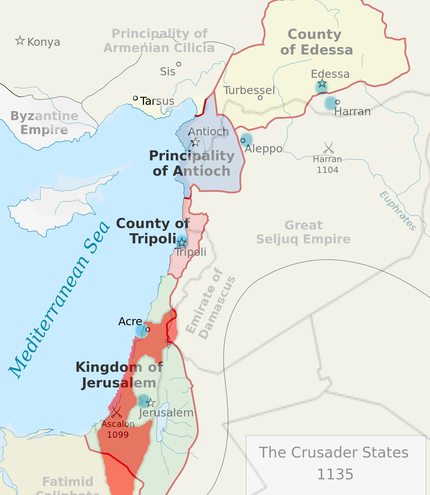

* [Index](index.md)
* [Crusader Castles](crusader-castle.md)
* [Mamluk Architecture](mamluk.md)

# Introduction

Crusader castles are historical sites that attract tourists. Contemporary maps that show their locations in relation to modern cities and roads are very practical for visitors who are planning trips and need to navigate the current transportation networks. Using contemporary maps maintains consistency with other geographical information. Users can relate easily to the locations. They can understand the locations' modern-day settings. This enhances public education about historical sites. People associate these structures with their present-day locations and understand the historical events in a modern context.

*Crusader States map overlayed with map of the modern Middle East. Modern Israel is highlighted in red.*

### Creation of the Crusader States During the First Crusade

> The Crusader States were created after the First Crusade (1095-1102 CE) in order to keep hold of the territorial gains made by Christian armies in the Middle East. The four small states were the Kingdom of Jerusalem, the County of Edessa, the County of Tripoli, and the Principality of Antioch...Jerusalem was captured in July 1099 CE, and a Muslim army defeated was at the Battle of Ascalon in August of the same year.

\- *Crusader States*, World History Encyclopedia

# References

* Boas, A. J. (1998). *Archaeological Sources for the History of Palestine: The Frankish Period: A Unique Medieval Society Emerges. Near Eastern Archaeology, 61(3), 138.* doi:10.2307/3210688.
* Cartwright, M. (2018). *Crusader States.* World History Encyclopedia. [https://www.worldhistory.org/Crusader_States/](https://www.worldhistory.org/Crusader_States/).
* *Crusader Castles.* Balian d'Ibelin and the Kingdom of Jerusalem. [https://www.defenderofjerusalem.com/crusader-castles.html.](https://www.defenderofjerusalem.com/crusader-castles.html)
* *Belvoir Castle.* Castles and Manor Houses around the World. [https://www.castlesandmanorhouses.com/page.php?key=Belvoir%20Castle.](https://www.castlesandmanorhouses.com/page.php?key=Belvoir%20Castle)
* Rabbat, N. (2002). *Perception of Architecture in Mamluk Sources.* Mamlūk Studies Review, Vol. VI. doi:/10.6082/M1XP7300.